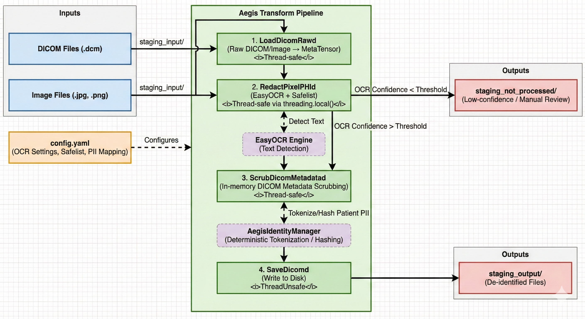

# MONAI Aegis

**Medical Image De-identification Pipeline with OCR and Metadata Scrubbing**

MONAI Aegis is a production-ready pipeline for de-identifying medical images (DICOM, JPEG, PNG) by removing Protected Health Information (PHI) while preserving critical clinical markers and image quality.

---

## 🌟 Features

### Visual De-identification (Pixel Redaction)
- **EasyOCR-based text detection** with configurable confidence thresholds
- **Thread-safe** OCR via `threading.local()` — safe for `DataLoader(num_workers > 0)`
- **Safelist support** for preserving clinical markers (ultrasound parameters, measurements)
- **Low-confidence routing** — images with uncertain OCR are flagged for manual review

### Metadata De-identification (DICOM)
- **Configurable PII mapping** with REMOVE / DUMMY / ZERO actions
- **Deterministic tokenization** for patient identifiers (enables re-identification if needed)
- **Private tag removal** for enhanced privacy
- **Pure in-memory scrubbing** — no file I/O during transformation

### Pipeline Architecture
- **MONAI-compliant transforms** — array + dictionary variants, `MetaTensor` propagation
- **Thread-safe by design** — only `SaveDicomd` (file I/O) is `ThreadUnsafe`
- **Four-step pipeline**: Load → Redact → Scrub → Save
- **Non-destructive** — input files remain unchanged

---

## 📦 Installation

### Prerequisites
- Python 3.8+
- Virtual environment recommended

### Install Package
```bash
git clone <repo-url>
cd aegis

python -m venv venv
source venv/bin/activate  # On Windows: venv\Scripts\activate

pip install -e monai_aegis/
```

---

## 🚀 Quick Start

### Python API
```python
from transforms.pipeline import build_pipeline

# Build the de-identification pipeline
pipeline = build_pipeline(
    config_path='monai_aegis/config/config.yaml',
    output_dir='staging_output'
)

# Process a DICOM file
result = pipeline({'image': 'staging_input/scan.dcm'})

# Process a JPEG file
result = pipeline({'image': 'staging_input/photo.jpg'})
```

### Command-Line Runner
```bash
# Process all files in staging_input/
python run_pipeline.py --config monai_aegis/config/config.yaml

# Output:
#   Processed files → staging_output/
#   Low-confidence files → staging_not_processed/ (manual review)
```

---

## ⚙️ Configuration

Edit `monai_aegis/config/config.yaml`:

```yaml
ocr:
  languages: ['en']
  gpu_usage: false
  confidence_threshold: 0.4

safelist:
  - '^B$'                        # B-mode indicator
  - '^FH?\s*\d+\.?\d*$'         # Frequency: FH5.0
  - '^D\s*\d+\.?\d*$'           # Depth: D 13.0
  - '\d+\.?\d*\s*(cm|mm|MHz)$'  # Measurements: 2.35 cm

pii_mapping:
  '(0010, 0010)': 'DUMMY'   # PatientName → TOKEN_xxxxx
  '(0010, 0020)': 'DUMMY'   # PatientID → TOKEN_xxxxx
  '(0008, 0020)': 'ZERO'    # StudyDate → 00000000
  '(0008, 0050)': 'REMOVE'  # AccessionNumber → removed
```

### PII Mapping Actions
| Action | Behavior | Example |
|--------|----------|---------|
| `DUMMY` | Replace with deterministic hash token | `John Doe` → `TOKEN_a1b2c3d4e5f6` |
| `REMOVE` | Delete the DICOM tag entirely | Tag removed from dataset |
| `ZERO` | Set to zero / empty value | `20250216` → `00000000` |

---

## 🧪 Testing

```bash
# Run all 18 unit tests
PYTHONPATH=monai_aegis python -m unittest discover tests/unit -v

# Run integration tests
PYTHONPATH=monai_aegis python -m unittest discover tests/integration -v
```

### Test Coverage
| Transform | Tests |
|-----------|-------|
| `RedactPixelPHI` / `RedactPixelPHId` | Visual redaction, safelist, shape preservation |
| `ScrubDicomMetadata` / `ScrubDicomMetadatad` | Tag scrubbing, no-I/O assertion, orientation |
| `LoadDicomRawd` | DICOM and JPEG loading |
| `detect_text` / `apply_redaction` | OCR detection, confidence filtering, redaction |

---

## 📁 Project Structure

```
aegis/
├── monai_aegis/                      # Installable package
│   ├── pyproject.toml                # PEP 621 package config
│   ├── config/
│   │   └── config.yaml               # De-identification settings
│   └── transforms/
│       ├── __init__.py                # Public API exports
│       ├── io.py                      # LoadDicomRaw/d, SaveDicom/d
│       ├── pixel.py                   # RedactPixelPHI/d (thread-safe OCR)
│       ├── metadata.py                # ScrubDicomMetadata/d (pure in-memory)
│       ├── utility.py                 # AegisIdentityManager (tokenization)
│       └── pipeline.py                # build_pipeline() composer
├── tests/
│   ├── unit/                          # 18 unit tests
│   └── integration/                   # End-to-end tests
├── run_pipeline.py                    # CLI entry point
├── Dockerfile                         # Container build
├── test_docker.sh                     # Docker test script
├── staging_input/                     # Input files (not tracked)
├── staging_output/                    # Processed output (not tracked)
└── staging_not_processed/             # Low-confidence files for review (not tracked)
```

---

## 🔧 Architecture

### Architecture Diagram



### Detailed Processing Steps

1. **Load (`LoadDicomRawd`)**: Reads various medical image formats (DICOM, JPEG, PNG) into a MONAI `MetaTensor` without mutating the original files. This avoids affine transforms that can rotate burned-in text away from OCR detection.
2. **Redact (`RedactPixelPHId`)**: A visual de-identification step that uses EasyOCR to detect text. It respects a safelist (regex-based) to ignore valid clinical markers and applies black-box redaction to other text. Images falling below the configured confidence threshold bypass further processing and are routed to `staging_not_processed/` for manual review.
3. **Scrub (`ScrubDicomMetadatad`)**: A pure in-memory metadata scrubber (primarily for DICOMs). It calls `AegisIdentityManager` to perform deterministic tokenization, dummy replacement, or removal of designated DICOM tags as defined in the configuration.
4. **Save (`SaveDicomd`)**: Writes the final, de-identified datasets back to disk from memory.

### Component Interaction & Thread Safety Model

The pipeline is intentionally designed around multithreading bottlenecks and file I/O safety when operating within a PyTorch `DataLoader(num_workers > 0)`.

* **Concurrent Processing**: Steps 1–3 (`Load`, `Redact`, `Scrub`) are entirely thread-safe and operate purely in-memory. By pushing the heavy OCR computation to parallel background workers, the pipeline scales across CPU cores.
* **Thread-Local Isolation**: To prevent locking issues and race conditions with stateful AI models, `RedactPixelPHId` utilizes Python's `threading.local()`. This guarantees every worker thread spins up its own isolated EasyOCR reader instance.
* **I/O Isolation for Safety**: The pipeline intentionally marks **Step 4 (`SaveDicomd`)** as `ThreadUnsafe`. MONAI detects this and routes all dataset saving sequential actions to the main thread. This prevents file locking contentions, HDD thrashing, and ensures files uniquely derived from their source are written securely without race conditions.

| Transform | Strategy | `num_workers > 0` |
|-----------|----------|-------------------|
| `LoadDicomRawd` | Stateless | ✅ Safe |
| `RedactPixelPHId` | `threading.local()` for EasyOCR | ✅ Safe |
| `ScrubDicomMetadatad` | Pure in-memory, no I/O | ✅ Safe |
| `SaveDicomd` | `ThreadUnsafe` mixin | ⚠️ Main thread sequential write |

---

## 🐳 Docker

```bash
# Build
docker build -t monai_aegis:latest .

# Run pipeline
docker run --rm \
  -v "$(pwd)/staging_input:/app/staging_input:ro" \
  -v "$(pwd)/staging_output:/app/staging_output" \
  monai_aegis:latest

# Run tests
docker run --rm monai_aegis:latest \
  python -m unittest discover /app/tests/unit -v
```

See [DOCKER_TESTING.md](DOCKER_TESTING.md) for full Docker guide.

---

## 🤝 Contributing

```bash
# Install dev dependencies
pip install -e "monai_aegis/[dev]"

# Format
black monai_aegis/transforms/ tests/

# Lint
flake8 monai_aegis/transforms/ tests/

# Type check
mypy monai_aegis/transforms/
```

---

## 📄 License

Apache 2.0 (pending)

---

## 🙏 Acknowledgments

- [MONAI](https://docs.monai.io/) — Medical Open Network for AI
- [EasyOCR](https://github.com/JaidedAI/EasyOCR) — OCR detection library
- [PyDICOM](https://pydicom.github.io/) — DICOM file handling
- [HIPAA De-identification Guidelines](https://www.hhs.gov/hipaa/for-professionals/privacy/special-topics/de-identification/index.html)
