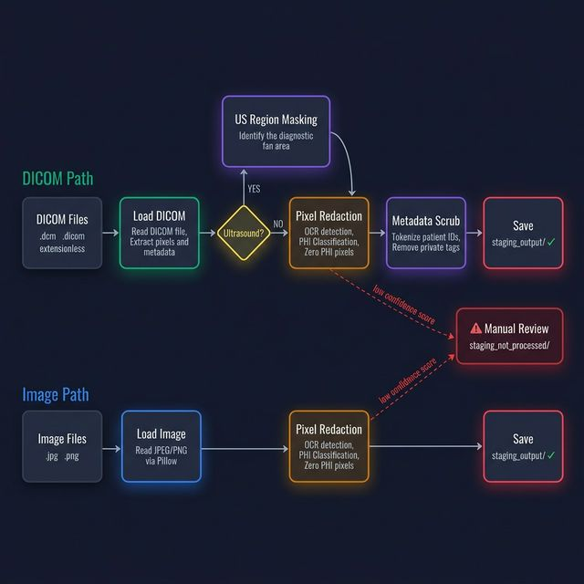
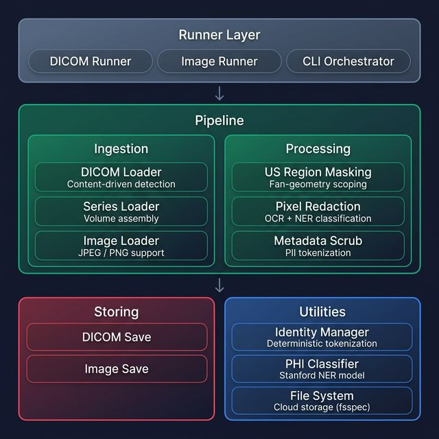
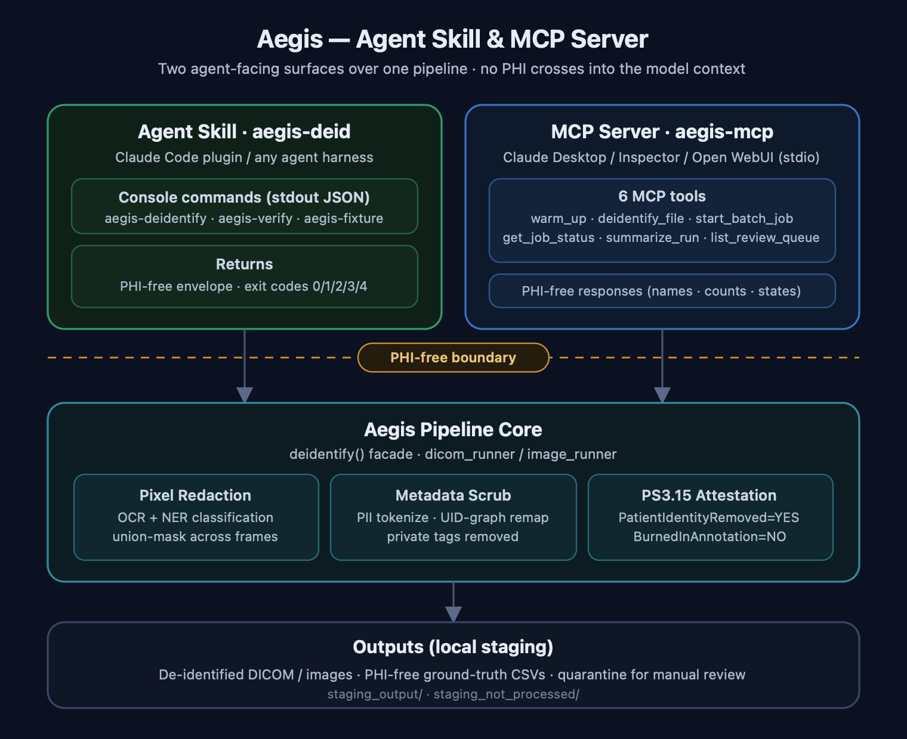

# Aegis

**Medical Image De-identification Pipeline with OCR, NER, and Series-Aware Volume Processing**

Aegis is a pipeline for de-identifying medical images (DICOM series, individual DICOMs, JPEG, PNG) by removing Protected Health Information (PHI) while preserving critical clinical markers, image quality, and geometric metadata.

### Use Cases

- Preparing anonymized medical imaging datasets for AI training
- Batch de-identification of DICOM studies
- Reproducible preprocessing pipelines for research datasets
- Extensible transforms for modality-specific workflows (e.g., ultrasound)
- Cloud-native processing with S3, GCS, or Azure storage backends

---

## 🌟 Features

### DICOM De-identification
- **PS3.15 Basic Application Level Confidentiality Profile** — metadata scrubbing follows the DICOM standard with REMOVE / DUMMY / ZERO / KEEP actions, configurable via `pii_mapping` in `config.yaml`; a mistyped tag or action fails the run at startup instead of silently passing PHI through
- **Recursive sequence scrubbing** — PII actions are applied to nested DICOM sequences (not just top-level tags)
- **Deterministic tokenization** — patient metadata (PatientName, PatientID) is replaced with reproducible hash tokens via `AegisIdentityManager`, enabling re-linkage when the original salt is available; tokens are automatically fitted to each tag's VR length limit so output stays DICOM-conformant
- **Full UID-graph remap** — Study/Series/SOP/FrameOfReference and referenced UIDs are all replaced deterministically as a consistent graph (PS3.15 action U), so patient linkage is broken while intra-object references still resolve; class/standard-root UIDs are preserved
- **Private tag removal** — all vendor-private tags are stripped for enhanced privacy
- **Content-driven discovery** — DICOM files are detected by reading the 132-byte preamble (`DICM` magic), not by file extension, so extensionless hospital exports are found automatically

### Pixel Redaction
- **Stanford NER-based PHI detection** — semantic classification via `stanford-deidentifier-base`
- **3-layer classification pipeline**: clinical allowlist → PHI heuristics → NER model
- **EasyOCR-based text detection** with configurable confidence thresholds
- **US fan-geometry scoped OCR** — reads `SequenceOfUltrasoundRegions` (0018,6011) from DICOM metadata to restrict OCR to non-diagnostic zones, eliminating false positives in the clinical fan area
- **Pixel-level union masking** — for multi-frame volumes, PHI detected on any sampled keyframe is propagated and zeroed across all frames, ensuring no PHI survives between slices
- **Adaptive keyframe sampling** — instead of scanning every frame, samples a configurable percentage (default 10%, minimum 3, maximum 25) and always includes the first and last frames
- **Low-confidence routing** — images with uncertain OCR are flagged for manual review
- **Regex safelist fallback** — preserved for environments without NER model
- **Fully configurable** — PHI labels, clinical allowlist, clinical patterns, and PHI heuristics all defined in `config.yaml`

### Pipeline Architecture
- **DICOM pipeline** (`monai_aegis.dicom_runner`) — DICOM single-file or series-aware volume mode
- **Image pipeline** (`monai_aegis.image_runner`) — JPEG/PNG single-file or series-aware folder processing
- **Unified orchestrator** (`monai_aegis.cli`) — `--mode auto|dicom|image`
- **Independent scaling** — each pipeline can run on separate infrastructure

### Ground-Truth Reporting & Validation
- **Per-run "ground truth" CSVs** — each run records exactly what was detected and redacted (`aegis_pixel_detections.csv` for pixels, `aegis_tag_actions.csv` for header tags), so output can be validated against a known answer key. PHI-free by default; the source `SOPInstanceUID` is the stable join key
- **PS3.15 attestation stamps** — every scrubbed DICOM is stamped so receivers can machine-verify de-identification from the object itself
- **Bring-your-own-database mode** — skip CSVs and pull the same records from the pipeline data dict via `monai_aegis.reporting.extract_records(...)`

See [Ground-Truth Reporting & Validation](#-ground-truth-reporting--validation) for the full column reference.

### Cloud Storage (fsspec) — experimental
- **Pluggable backends** — local filesystem, S3, GCS, Azure via `fsspec`, with `${VAR_NAME:default}` config interpolation and byte-stream I/O (no temp files)
- **Experimental** — only the core DICOM/image read/write is cloud-aware; reports, quarantine, verification, and the public API still use local paths. See [Cloud Storage](#cloud-storage-s3--gcs--azure) for scope.

---

## ⚖️ Standards Compliance

Aegis implements the **DICOM PS3.15 Basic Application Level Confidentiality
Profile** (Annex E) for DICOM metadata de-identification, with the following
options enabled:

- **Basic Application Level Confidentiality Profile** (mandatory baseline)
- **Clean Pixel Data Option** — OCR + NER-based burnt-in PHI removal
- **Retain Longitudinal Temporal Information with Modified Dates Option**
  (dates zeroed, not removed, to preserve relative temporal relationships)

Every output object is stamped with the PS3.15 **de-identification
attestation attributes** — `PatientIdentityRemoved=YES` (0012,0062),
`DeidentificationMethod` (0012,0063), `DeidentificationMethodCodeSequence`
(0012,0064) with the profile codes above (DCM 113100, 113101), and
`BurnedInAnnotation=NO` (0028,0301) after pixel cleaning — so receivers
can machine-verify de-identification from the object itself.

Patient-linkable DICOM UIDs are remapped as a graph (PS3.15 action U):
StudyInstanceUID, SeriesInstanceUID, SOPInstanceUID, FrameOfReferenceUID, and
referenced UIDs in nested sequences are all replaced with deterministically
generated UIDs — a value reused across the object maps to the same replacement,
so intra-object references still resolve. Class/standard-root UIDs (e.g.
SOPClassUID, TransferSyntaxUID) are preserved so the object stays valid.
Remapping is deterministic, enabling re-linkage when the original salt is available.

HIPAA Safe Harbor de-identification is satisfied as a consequence of
PS3.15 Basic Profile compliance, since the 18 HIPAA identifiers are a
subset of the tags addressed by the Basic Profile.

---

## 🔧 Architecture

### Pipeline Flow



The pipeline processes files through two distinct paths:

**DICOM Path** — Load DICOM → (if ultrasound: US Region Masking to scope OCR to annotation areas) → Pixel Redaction (OCR + NER on full image or scoped to non-diagnostic zones) → Metadata Scrub (tokenize patient IDs, remove private tags) → Save

**Image Path** — Load Image → Pixel Redaction (OCR + NER on full image) → Save. No metadata scrub since JPEG/PNG files have no DICOM tags.

Low-confidence OCR detections on either path are routed to `staging_not_processed/` for manual review.

### Component Overview



### Agent Skill & MCP Server

The same pipeline is exposed to AI agents through two surfaces — the
**agent skill** (`aegis-deid`, driving the console commands) and the
**MCP server** (`aegis-mcp`, six stdio tools). Both sit behind a PHI-free
boundary: responses carry only names, paths, counts, and job states — never
pixel data, OCR text, tokens, or tag values. See
[Skill Surface](#-skill-surface--single-command-de-identification-verification-fixtures)
and [MCP Server](#-mcp-server-ai-agent-interface) below.



---

## 📦 Installation

### Prerequisites
- Python 3.10+
- Virtual environment recommended

### Install Package
```bash
git clone <repo-url>
cd aegis

python -m venv venv
source venv/bin/activate  # On Windows: venv\Scripts\activate

pip install -e .
```

Optional extras:

```bash
pip install -e ".[mcp]"     # aegis-mcp server (Model Context Protocol)
pip install -e ".[cloud]"   # S3 / GCS / Azure storage backends
pip install -e ".[dev]"     # tests, linters, build tooling
```

Installing registers the console commands `aegis-pipeline` (batch runner),
`aegis-deidentify` (single-invocation skill surface), `aegis-verify`
(independent verification), and `aegis-fixture` (synthetic test data); the
`[mcp]` extra adds `aegis-mcp` (the MCP server). See
[Skill Surface](#-skill-surface--single-command-de-identification-verification-fixtures)
below, and [docs/skills/](docs/skills/) for wrapping Aegis as an agent skill
in any ecosystem.

---

## 🚀 Quick Start

### Command-Line Runners
```bash
# DICOM pipeline  (series mode is default; add --mode single for per-file)
python -m monai_aegis.dicom_runner

# Image pipeline
python -m monai_aegis.image_runner

# Unified orchestrator — runs both pipelines
aegis-pipeline --mode auto
```

Config defaults to the packaged `config.yaml`; pass `--config path.yaml` to
override. Processed files land in `staging_output/<dicom|image>/<timestamp>/`;
rejected or low-confidence files go to `staging_not_processed/` for review.

---

## ⚙️ Configuration

Edit `src/monai_aegis/config/config.yaml`. Supports `${VAR_NAME:default}` environment variable interpolation:

```yaml
paths:
  input_dir: '${AEGIS_INPUT_DIR:staging_input}'
  output_dir: '${AEGIS_OUTPUT_DIR:staging_output}'
  not_processed_dir: '${AEGIS_REVIEW_DIR:staging_not_processed}'
  dicom_folder: 'dicom'
  image_folder: 'image'
  timestamp_format: '%Y-%m-%d_%H-%M'

runtime:
  dataloader_num_workers: 0

reporting:
  save_ground_truth: true   # true → write aegis_pixel_detections.csv + aegis_tag_actions.csv
                            #        to the run output directory
                            # false → no CSVs; read records from the data dict yourself
  include_phi_text: '${AEGIS_INCLUDE_PHI_TEXT:false}'  # opt-in: ALSO write verbatim OCR text
                            # (raw PHI) as aegis_pixel_detections_PHI.csv — validation only
  phi_report_dir: '${AEGIS_PHI_REPORT_DIR:}'  # required when include_phi_text is true;
                            # must differ from the run output directory

storage:
  protocol: '${AEGIS_STORAGE_PROTOCOL:file}'   # file (supported); s3/gs/az/memory (experimental)
  options: {}                                   # fsspec options (credentials, etc.)

tokenization:
  salt: '${AEGIS_TOKEN_SALT:}'

series:
  enabled: true
  accepted_modalities: ['CT', 'MR', 'US', 'CR', 'DX', 'MG', 'PT', 'XA', 'RF', 'OT']
  keyframe_sampling:
    sample_pct: 0.10    # Sample 10% of frames as keyframes
    floor: 3             # Minimum keyframes (below this, scan all)
    ceiling: 25          # Maximum keyframes for very large volumes
  output_structure: 'hierarchical'

us_regions:
  enabled: true                   # Enable US fan-geometry scoped OCR
  zero_outside_regions: true      # Zero diagnostic pixels before OCR

ocr:
  languages: ['en']
  gpu_usage: false
  confidence_threshold: 0.4
  model_storage_directory: '${AEGIS_OCR_MODEL_DIR:}'      # pre-bundled EasyOCR weights dir
  download_enabled: '${AEGIS_MODEL_DOWNLOADS:true}'       # false → never download at runtime

ner:
  enabled: true                   # Set false to fall back to regex safelist
  model_name: 'StanfordAIMI/stanford-deidentifier-base'
  model_revision: '661b9c1c717d3165512d440abc3700c386aefab6'  # exact model-repo commit —
                                  # pinned so the model cannot silently change under a deployment
  local_files_only: '${AEGIS_HF_OFFLINE:false}'  # true → resolve from local HF cache, zero network calls
  device: '${AEGIS_DEVICE:cpu}'   # 'cpu', 'cuda', or 'mps'
  phi_labels:                     # NER entity types treated as PHI
    - PATIENT
    - DOCTOR
    - HOSPITAL
    - DATE
    - IDNUM
    # ... (22 labels total)
  clinical_allowlist:             # Terms never redacted
    - mindray
    - ge
    - adult abd n
    # ... (device manufacturers, imaging modes)
  clinical_patterns:              # Regex for clinical/technical text (preserved)
    - '^(F\s*H?\d|D\s+\d|G\s+\d|FR\s+\d|DR\s+\d)'
    - '^(AP|MI|TIS|SSI)\s+\d'
    # ... (probe IDs, measurements, exam types)
  phi_heuristic_patterns:         # Regex for PHI in short OCR fragments (redacted)
    - '^\d{8}[-/]\d{6}[-/]?\w*$'  # Date-ID combos
    - '(?i)(hospital|clinic|diagnostic|medical)'
    # ... (dates, doctor names, patient IDs)

pii_mapping:
  '(0010, 0010)': 'DUMMY'   # PatientName → TOKEN_xxxxx
  '(0010, 0020)': 'DUMMY'   # PatientID → TOKEN_xxxxx
  '(0010, 0030)': 'REMOVE'  # PatientBirthDate → removed
  '(0008, 0020)': 'ZERO'    # StudyDate → 00000000
  '(0008, 0050)': 'REMOVE'  # AccessionNumber → removed
  # Add any tag your deployment needs — actions apply recursively into
  # nested sequences. Invalid tags or actions fail the run at startup.
```


### Cloud Storage (S3 / GCS / Azure)

> **Experimental at this moment.** Cloud/remote backends are supported for the
> core DICOM/image read and write path, and selecting a non-`file` protocol
> emits a startup warning to that effect. Ground-truth report writing,
> review-queue quarantine, the verification pass (`aegis-verify`), and the
> public `deidentify()` API's input/output path handling currently operate on
> local paths — so a cloud run can split its outputs between remote and local
> storage. Validate results before using this beyond experimentation; full
> end-to-end cloud support is in progress.

```yaml
# config.prod.yaml — overlay for cloud deployment
storage:
  protocol: 's3'
  options:
    key: '${AWS_ACCESS_KEY_ID}'
    secret: '${AWS_SECRET_ACCESS_KEY}'

paths:
  input_dir: 's3://my-bucket/incoming'
  output_dir: 's3://my-bucket/deidentified'
```

```bash
# Apply overlay via environment variable
export AEGIS_CONFIG_OVERRIDE=config.prod.yaml
pip install s3fs  # one-time
python -m monai_aegis.dicom_runner --config src/monai_aegis/config/config.yaml
```

| Backend | Protocol | Extra Package |
|---------|----------|---------------|
| Local   | `file`   | (built-in)    |
| AWS S3  | `s3`     | `s3fs`        |
| GCS     | `gs`     | `gcsfs`       |
| Azure   | `az`     | `adlfs`       |

### Offline / Air-Gapped Deployment

The NER model is **pinned to an exact revision** in `config.yaml`
(`ner.model_revision`), so the model cannot silently change under a
deployment. Both model sources can be forced fully offline — no network
calls at runtime, not even update checks.

```bash
# 1. On a connected machine (or Docker build stage): prefetch pinned weights
python scripts/prefetch_models.py --config src/monai_aegis/config/config.yaml

# 2. Run fully offline
export AEGIS_HF_OFFLINE=true        # NER: resolve from local HF cache only
export AEGIS_MODEL_DOWNLOADS=false  # EasyOCR: never attempt a download
aegis-pipeline --config src/monai_aegis/config/config.yaml
```

| Env var | Config key | Effect |
|---------|-----------|--------|
| — | `ner.model_revision` | Exact NER model commit (pinned in config.yaml) |
| `AEGIS_HF_OFFLINE` | `ner.local_files_only` | `true` → zero HuggingFace network calls |
| `AEGIS_OCR_MODEL_DIR` | `ocr.model_storage_directory` | Pre-bundled EasyOCR weights dir |
| `AEGIS_MODEL_DOWNLOADS` | `ocr.download_enabled` | `false` → EasyOCR never downloads |

The Docker image bakes all weights in at build time and sets the offline
flags, so containers run air-gapped by default.

### NER Classification Pipeline

When `ner.enabled: true`, each OCR-detected text goes through a 3-layer pipeline:

| Layer | Source | Action | Example |
|-------|--------|--------|---------|
| 1. Clinical allowlist | `ner.clinical_allowlist` | **Preserve** | `mindray`, `adult abd n` |
| 2. Clinical patterns | `ner.clinical_patterns` | **Preserve** | `FH5.0`, `D 13.0`, `SC5-1N` |
| 3. PHI heuristics | `ner.phi_heuristic_patterns` | **Redact** | `20260117-091825-6AAA` |
| 4. Stanford NER | `ner.phi_labels` | **Redact if PHI** | Names, remaining identifiers |

### PII Mapping Actions
| Action | Behavior | Example |
|--------|----------|---------|
| `DUMMY` | Replace with deterministic hash token | `John Doe` → `TOKEN_a1b2c3d4e5f6a7b8` |
| `REMOVE` | Delete the DICOM tag entirely | Tag removed from dataset |
| `ZERO` | Set to zero / empty value | `20250216` → `00000000` |
| `KEEP` | Retain the value deliberately (audited with `redacted=False`) | Value unchanged, retention on record |

Actions are validated when the pipeline is constructed — an unknown action
(e.g. a `DELETE` typo) or malformed tag raises immediately, before any file
is processed, rather than silently leaving that tag's PHI in place.
(`ATTEST` rows in the tag report are stamps Aegis writes, not a
configurable action.)

`DUMMY` tokens are `TOKEN_` + 16 hex characters (22 total). When the target
tag's VR caps value length below that — the 16-char VRs `SH` / `AE` / `CS`,
e.g. `StudyID` (0020,0010, VR=SH) — the token is deterministically truncated
to fit so the output stays DICOM-conformant; longer VRs (`LO`, `PN`, text
VRs) keep the full token.

---

## 📊 Ground-Truth Reporting & Validation

Aegis attacks PHI on two fronts — **burnt-in pixel text** (`RedactPixelPHId`,
OCR + NER) and **header metadata** (`ScrubDicomMetadatad`, `pii_mapping`). When
`reporting.save_ground_truth: true` (default), each run writes one CSV per
stage to the run output directory, capturing exactly what was detected and
redacted. These are Aegis's *own* ground truth and can be diffed against a
synthetic/manual answer key to compute precision/recall.

### Output location
Reports are written alongside the cleaned files in the timestamped run
directory:

```
staging_output/dicom/<timestamp>/
├── <cleaned DICOM files…>
├── aegis_pixel_detections.csv      # burnt-in pixel PHI (RedactPixelPHId)
└── aegis_tag_actions.csv           # header tag scrubbing (ScrubDicomMetadatad)
```
(Image runs write to `staging_output/image/<timestamp>/`. PNG/JPEG inputs have
no DICOM header, so image runs emit only `aegis_pixel_detections.csv` —
`aegis_tag_actions.csv` is not created, and SOP UID columns are blank.)

### `aegis_pixel_detections.csv` — one row per OCR region
| Column | Meaning |
|--------|---------|
| `source_path` | Source file path |
| `original_sop_uid` | SOPInstanceUID of the **source** DICOM (join key) |
| `deid_sop_uid` | Regenerated SOPInstanceUID of the de-identified output |
| `frame_index` | Frame the text was found on (blank for single-frame) |
| `bbox_x, bbox_y, bbox_w, bbox_h` | Detection box (top-left + size) |
| `text_token` | Salted token of the OCR text (same salt as header `DUMMY` tokens) — **never the verbatim text** |
| `text_len` | Character length of the detected text |
| `confidence` | OCR confidence |
| `decision` | `redacted`, `safelisted`, or `low_confidence` |

**This file is PHI-free by design** — it lives inside the de-identified
output, so the detected text appears only as a token. Same text → same
token, so repeats stay correlatable, and validation works by tokenizing
the ground-truth strings with the same salt and joining on equality.

Need the verbatim text (e.g. manual review during validation)? Set
`reporting.include_phi_text: true` **and** point `reporting.phi_report_dir`
at a directory *outside* the run output — Aegis then additionally writes
`aegis_pixel_detections_PHI.csv` (same columns, with `ocr_text` instead of
the token) there, and refuses to run if the directory is unset or equal to
the output directory. Handle that file as PHI.

#### Error responses and logs

Tool/CLI **responses** are PHI-free by default: on failure they carry only the
exception *type* (a stable error code), never the raw message, which
third-party libraries can populate with tag values or OCR text. `AEGIS_VERBOSE_ERRORS=1`
restores the full message for local debugging — **never enable it in a shared,
multi-tenant, agent, or production environment**, where the response (and any
LLM/agent that reads it) would then receive raw PHI. Use it only on a machine
where you own the data.

Separately, **server-side logs are not PHI-free**: failures are logged with
full tracebacks (`logger.exception`), which may contain PHI. Treat log output
as sensitive — restrict and scrub access to it accordingly.

### `aegis_tag_actions.csv` — one row per scrubbed header tag
| Column | Meaning |
|--------|---------|
| `source_path` | Source file path |
| `original_sop_uid` / `deid_sop_uid` | Source vs. output SOPInstanceUID |
| `tag` | DICOM tag, e.g. `(0010,0010)` |
| `keyword` | Tag keyword, e.g. `PatientName` |
| `action` | `REMOVE` / `DUMMY` / `ZERO` / `KEEP` / `ATTEST` |
| `redacted` | `True` when the action de-identified the element (`False` for `KEEP` retention and `ATTEST` stamps) |

The PS3.15 de-identification attestation attributes (see [Standards
Compliance](#-standards-compliance)) appear in this report as `ATTEST` rows.

### Validating against external ground truth
The *original* `SOPInstanceUID` is preserved in both reports (Aegis regenerates
the UID on output, but the source UID is captured before that), so the files
join directly to ground truth keyed on the source UID:

- **Pixel PHI** — join on `original_sop_uid`, match boxes by IoU, then compare
  `decision == "redacted"` against the expected `is_phi`.
- **Header PHI** — join on `original_sop_uid` + `tag` to confirm each expected
  tag was acted on.

### Bring-your-own-database mode
Set `reporting.save_ground_truth: false` to skip CSV writing entirely and pull
the same records from the pipeline data dict yourself:

```python
from monai_aegis import api, reporting
from monai_aegis.transforms.pipeline import build_pipeline

# api.default_config_path() resolves the packaged config regardless of layout.
pipeline = build_pipeline(config_path=api.default_config_path(),
                          output_dir="out", input_dir="in")
result = pipeline({"image": "/path/to/file.dcm"})

pixel_rows, tag_rows = reporting.extract_records(result)   # CSV-ready dict rows
# → persist pixel_rows / tag_rows in your own datastore
```

---

## 🛡️ Skill Surface — Single-Command De-identification, Verification, Fixtures

Three console commands expose the pipeline as a scriptable, agent-friendly
surface. Behavior stays config-driven — the flags identify the invocation;
customization happens in YAML overlays, never code.

```bash
# De-identify a file or directory → PHI-free JSON envelope on stdout
aegis-deidentify /path/to/input --output-dir /path/to/out

# Independently verify a de-identified run against a checklist
aegis-verify /path/to/out

# Generate a synthetic fixture (fake burnt-in text + fake header PHI)
aegis-fixture demo.dcm --text "SYNTHETIC PATIENT" --text "ID SYN-0001"
```

**`aegis-deidentify`** writes artifacts and ground-truth reports directly
into `--output-dir` (no timestamped nesting) and emits exactly one JSON
envelope on stdout (schema: `monai_aegis/schemas/envelope.schema.json`;
logs go to stderr). Exit codes: `0` success · `1` failed · `2` bad
invocation · `3` partial (some files failed) · `4` success but files were
routed to manual review. The packaged skill overlay
(`monai_aegis/config/config.skill.yaml`) applies by default; replace it
with `--overlay your.yaml` or `AEGIS_CONFIG_OVERRIDE`. With a fixed
`AEGIS_TOKEN_SALT`, identical inputs reproduce byte-identical outputs —
tokens **and** regenerated DICOM UIDs are deterministic.

**`aegis-verify`** is the second pass that checks the claim, not the exit
code: it re-opens the output DICOMs and reports and asserts the
de-identification guarantees — attestation stamps, tokenized identifiers,
removed/zeroed PHI tags, no private tags, PHI-free report shape, and that
every output is accounted for in the tag report. The assertions are a YAML
checklist (`monai_aegis/checklists/ps315.yaml` by default) validated at
load time; sites with a custom `pii_mapping` supply a matching checklist
via `--checklist`. Exit codes: `0` pass · `1` could not run · `2` bad
invocation · `3` checks failed. Verification needs only pydicom + PyYAML —
no OCR/NER models — so audits can run anywhere.

**`aegis-fixture`** generates deliberately fake inputs (parameterized size,
burnt-in lines, header values) so any harness can exercise the full
pipeline — and the verification loop — without real data. Generation is
deterministic: same arguments, same bytes.

The same functionality is available as library calls:
`monai_aegis.api.deidentify(...)`, `monai_aegis.verify.verify_run(...)`,
and `monai_aegis.fixtures.make_synthetic_dicom(...)`.

---

## 🤖 MCP Server (AI-Agent Interface)

The MCP server (`monai_aegis.mcp_server`) exposes the pipeline as six
[Model Context Protocol](https://modelcontextprotocol.io) tools so an
orchestrating model — Claude Desktop, MCP Inspector, or a local Ollama model
behind mcpo/Open WebUI — can run, monitor, and audit de-identification
through natural language. **No PHI ever enters a model context window**: tool
responses carry only file names, paths, counts, decision categories, tag
keywords/actions, timings, and job states — never pixel data, OCR text, text
tokens, or DICOM tag values.

Install and launch:

```bash
pip install 'monai-aegis[mcp]'   # ships the server with the package
aegis-mcp                         # console command (stdio transport)
```

The root script `aegis_mcp_server.py` remains as a thin launcher, so
`python aegis_mcp_server.py` and existing client configs that reference that
path keep working.

| Tool | Purpose |
|------|---------|
| `warm_up()` | Preload OCR + NER models (call first; seconds when cached) |
| `deidentify_file(input_path, output_dir="")` | Synchronous single file (DICOM/JPEG/PNG) |
| `start_batch_job(input_dir, output_dir="", mode="auto")` | Async directory-scale job; returns a `job_id` immediately. `mode`: `auto` (DICOM + images, default), `dicom`, or `image` — mirroring `run_pipeline.py --mode` |
| `get_job_status(job_id)` | Poll batch progress (state, counts, errors) |
| `summarize_run(run_dir, source_filename="")` | Audit a run from its ground-truth CSVs (or job summary JSON) |
| `list_review_queue()` | Files quarantined for manual review (names only) |

Batch jobs write per-job output to `staging_output/mcp/<job_id>/`, including
the standard ground-truth CSVs and a PHI-free `job_summary_<job_id>.json`.
Single-file calls default to a shared `staging_output/mcp/` directory where
ground-truth rows **accumulate across calls**: re-running a file replaces
only that file's rows, so `summarize_run` can audit the whole directory at
any time.

**Claude Desktop** (`claude_desktop_config.json`):

```json
{
  "mcpServers": {
    "aegis": {
      "command": "/path/to/aegis/venv/bin/python",
      "args": ["/path/to/aegis/aegis_mcp_server.py"],
      "env": {
        "AEGIS_OUTPUT_DIR": "/path/to/aegis/staging_output",
        "AEGIS_REVIEW_DIR": "/path/to/aegis/staging_not_processed",
        "AEGIS_DEVICE": "mps"
      }
    }
  }
}
```

**MCP Inspector** (manual/debug testing):

```bash
npx @modelcontextprotocol/inspector venv/bin/python aegis_mcp_server.py
```

**Open WebUI + Ollama** (via the mcpo OpenAPI bridge):

```bash
uvx mcpo --port 8000 -- venv/bin/python aegis_mcp_server.py
# Open WebUI → Settings → Tools → add http://localhost:8000
# (use http://host.docker.internal:8000 when Open WebUI runs in Docker)
# Use a tool-capable model, e.g. qwen2.5:7b
```

The server is stdio-only (mcpo provides HTTP bridging), logs exclusively to
stderr, and keeps all models on a single dedicated pipeline thread so
`warm_up` benefits every subsequent call. Server constants (paths, response
limits, batch modes) live in `monai_aegis/config/mcp_server_config.py`. The
packaged `config.yaml` is resolved from the installed package automatically —
no path env var is needed. Environment: `AEGIS_OUTPUT_DIR` / `AEGIS_REVIEW_DIR`
override the default output and review directories (relative to the launch
directory otherwise, so set them to absolute paths when the host launches the
server with an unpredictable working directory), and `AEGIS_DEVICE`
(`cpu`/`mps`/`cuda`, consumed by the NER config).

### Claude Code Plugin (Agent Skill + MCP)

This repository doubles as a [Claude Code plugin marketplace](https://docs.anthropic.com/en/docs/claude-code/plugins).
The `aegis` plugin bundles an **agent skill** (`aegis-deid`, teaching Claude
the de-identification workflow, CLI fallback, and PHI-handling guardrails)
and an **MCP registration** for `aegis_mcp_server.py`.

```bash
# 1. Optional: pin where the server writes output/review files (add to your shell
#    profile). Absolute paths are recommended so files land in a known place
#    regardless of the host's launch directory.
export AEGIS_OUTPUT_DIR=/path/to/aegis/staging_output          # optional
export AEGIS_REVIEW_DIR=/path/to/aegis/staging_not_processed   # optional
export AEGIS_DEVICE=mps                  # optional: cpu (default) / mps / cuda

# 2. Inside Claude Code:
#    /plugin marketplace add lakshmi-mahabaleshwara/aegis
#    /plugin install aegis@aegis
```

Installing the plugin registers the six MCP tools above in Claude Code and
enables the skill for natural-language use ("de-identify this DICOM folder").
This is independent of Claude Desktop — an existing `claude_desktop_config.json`
entry keeps working unchanged, and each client spawns its own server process.

---

## 🧪 Testing

```bash
# Run unit tests
python -m unittest discover tests/unit -v

# Run integration tests
python -m unittest discover tests/integration -v

# The reporting tests are pytest-style and are not picked up by unittest —
# run them (or the whole suite) with pytest:
python -m pytest tests/ -q
```


---

## 📁 Project Structure

```
aegis/
├── pyproject.toml                    # PEP 621 package config (src/ layout)
├── MANIFEST.in                       # sdist data-file inclusion
├── src/
│   └── monai_aegis/                  # Installable package
│       ├── cli.py                    # aegis-pipeline entry point
│       ├── api.py                    # deidentify() — single-invocation skill facade
│       ├── skill_cli.py              # aegis-deidentify entry point
│       ├── envelope.py               # PHI-free result envelope builder (shared surface)
│       ├── verify.py                 # Declarative checklist verification engine
│       ├── verify_cli.py             # aegis-verify entry point
│       ├── fixtures.py               # aegis-fixture — synthetic test-data generator
│       ├── mcp_server.py             # aegis-mcp — Model Context Protocol server
│       ├── dicom_runner.py           # Packaged DICOM orchestration
│       ├── image_runner.py           # Packaged image orchestration
│       ├── reporting.py              # Ground-truth CSV reporting (detections + tag actions)
│       ├── config/
│       │   ├── config.yaml           # De-identification + NER + storage + series settings
│       │   ├── config.skill.yaml     # Skill-mode overlay (deterministic, flat output)
│       │   ├── config_loader.py      # Env var interpolation + overlay merging
│       │   ├── mcp_server_config.py  # aegis-mcp paths, limits, and FastMCP instance
│       │   └── storage.py            # AegisFileSystem (fsspec wrapper)
│       ├── schemas/                  # JSON Schemas: envelope + verification report
│       ├── checklists/               # Verification checklists (ps315.yaml default)
│       └── transforms/               # MONAI transforms (load/redact/scrub/save, pipeline)
├── tests/
│   ├── unit/                         # Unit tests
│   └── integration/                  # End-to-end tests (models required)
├── scripts/
│   ├── prefetch_models.py            # Download pinned model weights for offline/Docker builds
│   ├── bench_aegis.py                # Public-dataset benchmark runner
│   └── prepare_pydicom_samples.py    # Benchmark dataset preparation
├── docker/
│   ├── Dockerfile                    # Container build (build context = repo root)
│   ├── DOCKER_TESTING.md             # Docker guide
│   └── test_docker.sh                # Build + test-in-container script
├── notebooks/
│   └── aegis_demo.ipynb              # Interactive walkthrough notebook
├── docs/skills/                      # Skill kit: adapter contract, SKILL template, disclaimer
├── run_dicom_pipeline.py             # Compatibility wrapper for monai_aegis.dicom_runner
├── run_image_pipeline.py             # Compatibility wrapper for monai_aegis.image_runner
├── run_pipeline.py                   # Compatibility wrapper for monai_aegis.cli
├── aegis_mcp_server.py               # Thin launcher → monai_aegis.mcp_server (aegis-mcp)
├── CHANGELOG.md                      # Release history (semantic versioning)
├── staging_input/                    # Input files (not tracked)
├── staging_output/                   # Processed output (not tracked)
└── staging_not_processed/            # Low-confidence files for review (not tracked)
```

---


## ⚠️ Error Handling

All transforms use a custom exception hierarchy (defined in `exceptions.py`) that carries **filepath** and **transform name** for diagnostic context:

```
AegisTransformError          ← base (catch-all)
├── DicomLoadError           ← corrupted / unreadable DICOM
├── ImageLoadError           ← unreadable JPEG / PNG
├── PixelRedactionError      ← OCR / NER failure
├── MetadataScrubError       ← tag parsing / pixel injection
├── DicomSaveError           ← write failure
├── SeriesLoadError          ← series assembly / geometry mismatch
└── SeriesSaveError          ← series write failure
```

**Usage in calling code:**

```python
from monai_aegis.transforms.exceptions import AegisTransformError, DicomLoadError

try:
    result = pipeline({'image': filepath})
except DicomLoadError as e:
    print(f"Bad DICOM: {e.filepath} in {e.transform}")
except AegisTransformError as e:
    print(f"Pipeline error: {e}")  # catches any transform failure
```

---

## 🐳 Docker

```bash
# Build (Dockerfile lives under docker/; build context is the repo root)
docker build -f docker/Dockerfile -t aegis:latest .

# Run DICOM pipeline
docker run --rm \
  -v "$(pwd)/staging_input:/app/staging_input:ro" \
  -v "$(pwd)/staging_output:/app/staging_output" \
  aegis:latest aegis-pipeline --mode dicom

# Run Image pipeline
docker run --rm \
  -v "$(pwd)/staging_input:/app/staging_input:ro" \
  -v "$(pwd)/staging_output:/app/staging_output" \
  aegis:latest aegis-pipeline --mode image

# Run tests
docker run --rm aegis:latest \
  python -m unittest discover /app/tests/unit -v
```

See [docker/DOCKER_TESTING.md](docker/DOCKER_TESTING.md) for full Docker guide.

---

## 🤝 Contributing

```bash
# Install dev dependencies
pip install -e ".[dev]"

# Format
black src/monai_aegis/ tests/

# Lint
flake8 src/monai_aegis/ tests/

# Type check
mypy src/monai_aegis/
```

---

## 📄 License

Apache 2.0

---

## 🙏 Acknowledgments

- [MONAI](https://github.com/Project-MONAI) — Medical Open Network for AI
- [StanfordAIMI](https://huggingface.co/StanfordAIMI/stanford-deidentifier-base) — Stanford De-identifier NER model
- [EasyOCR](https://github.com/JaidedAI/EasyOCR) — OCR detection library
- [HuggingFace Transformers](https://huggingface.co/docs/transformers/) — NER pipeline
- [PyDICOM](https://pydicom.github.io/) — DICOM file handling
- [HIPAA De-identification Guidelines](https://www.hhs.gov/hipaa/for-professionals/privacy/special-topics/de-identification/index.html)
