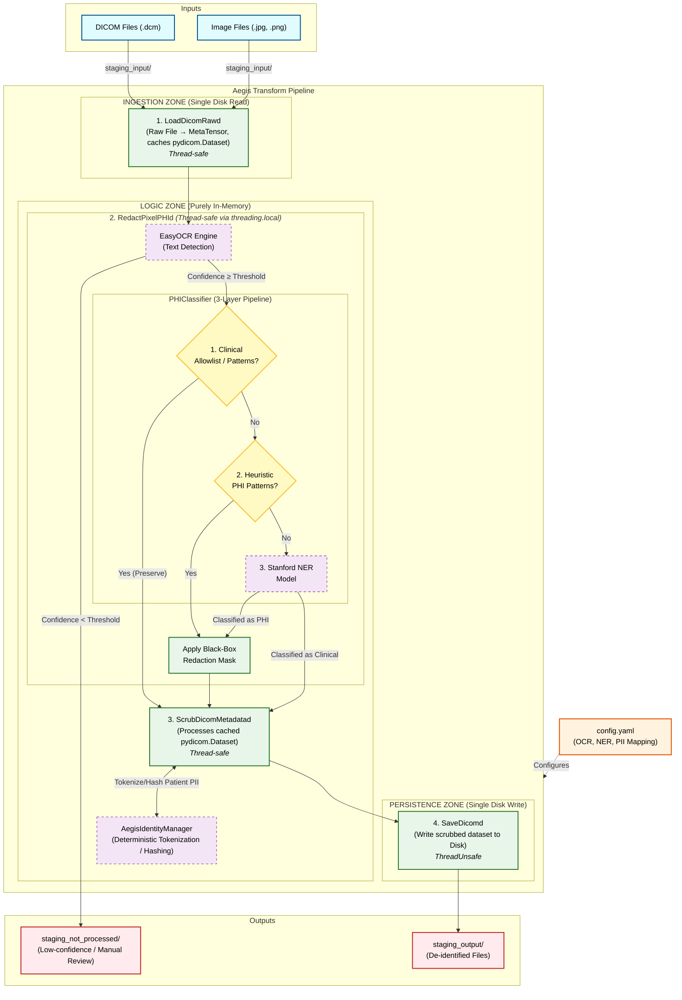
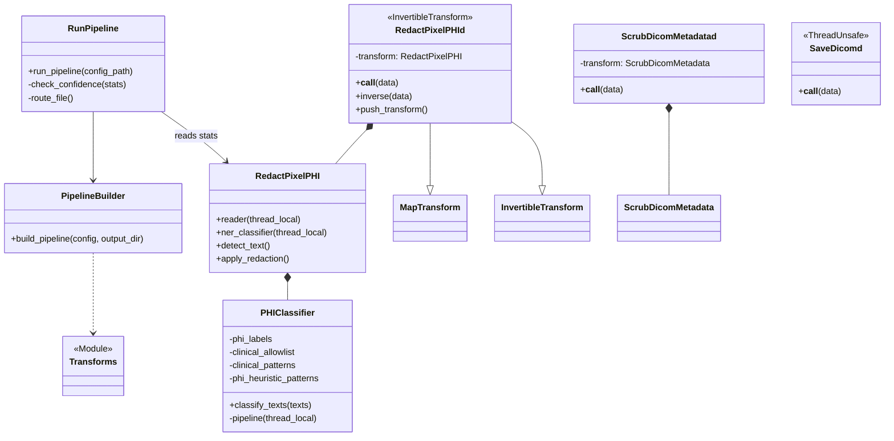

# MONAI Aegis

**Medical Image De-identification Pipeline with OCR and Metadata Scrubbing**

MONAI Aegis is a production-ready pipeline for de-identifying medical images (DICOM, JPEG, PNG) by removing Protected Health Information (PHI) while preserving critical clinical markers and image quality.

---

## 🌟 Features

### Visual De-identification (Pixel Redaction)
- **Stanford NER-based PHI detection** — semantic classification via `stanford-deidentifier-base` (F1 ≥ 97.9%)
- **3-layer classification pipeline**: clinical allowlist → PHI heuristics → NER model
- **EasyOCR-based text detection** with configurable confidence thresholds
- **Thread-safe** OCR + NER via `threading.local()` — safe for `DataLoader(num_workers > 0)`
- **Regex safelist fallback** — preserved for environments without NER model
- **Low-confidence routing** — images with uncertain OCR are flagged for manual review
- **InvertibleTransform** — redaction mask tracked through MONAI's transform history for spatial consistency
- **Fully configurable** — PHI labels, clinical allowlist, clinical patterns, and PHI heuristics all defined in `config.yaml`

### Metadata De-identification (DICOM)
- **Configurable PII mapping** with REMOVE / DUMMY / ZERO actions
- **Deterministic tokenization** for patient identifiers (enables re-identification if needed)
- **Private tag removal** for enhanced privacy
- **Pure in-memory scrubbing** — no file I/O during transformation

### Pipeline Architecture
- **MONAI-compliant transforms** — array + dictionary variants, `MetaTensor` propagation
- **Invertible redaction** — `RedactPixelPHId` inherits from `InvertibleTransform`, enabling spatial tracking of redacted regions through downstream transforms
- **Safety lock** — warns when prior spatial transforms may compromise OCR accuracy
- **Thread-safe by design** — only `SaveDicomd` (file I/O) is `ThreadUnsafe`
- **Four-step pipeline**: Load → Redact → Scrub → Save
- **Non-destructive** — input files remain unchanged

---

## 📦 Installation

### Prerequisites
- Python 3.8+
- Virtual environment recommended

### Install Package
```bash
git clone <repo-url>
cd aegis

python -m venv venv
source venv/bin/activate  # On Windows: venv\Scripts\activate

pip install -e monai_aegis/
```

---

## 🚀 Quick Start

### Python API
```python
from transforms.pipeline import build_pipeline

# Build the de-identification pipeline
pipeline = build_pipeline(
    config_path='monai_aegis/config/config.yaml',
    output_dir='staging_output'
)

# Process a DICOM file
result = pipeline({'image': 'staging_input/scan.dcm'})

# Process a JPEG file
result = pipeline({'image': 'staging_input/photo.jpg'})
```

### Command-Line Runner
```bash
# Process all files in staging_input/
python run_pipeline.py --config monai_aegis/config/config.yaml

# Output:
#   Processed files → staging_output/
#   Low-confidence files → staging_not_processed/ (manual review)
```

---

## ⚙️ Configuration

Edit `monai_aegis/config/config.yaml`:

```yaml
ocr:
  languages: ['en']
  gpu_usage: false
  confidence_threshold: 0.4

ner:
  enabled: true                   # Set false to fall back to regex safelist
  model_name: 'StanfordAIMI/stanford-deidentifier-base'
  device: 'cpu'                   # 'cpu', 'cuda', or 'mps'
  phi_labels:                     # NER entity types treated as PHI
    - PATIENT
    - DOCTOR
    - HOSPITAL
    - DATE
    - IDNUM
    # ... (22 labels total)
  clinical_allowlist:             # Terms never redacted
    - mindray
    - ge
    - adult abd n
    # ... (device manufacturers, imaging modes)
  clinical_patterns:              # Regex for clinical/technical text (preserved)
    - '^(F\s*H?\d|D\s+\d|G\s+\d|FR\s+\d|DR\s+\d)'
    - '^(AP|MI|TIS|SSI)\s+\d'
    # ... (probe IDs, measurements, exam types)
  phi_heuristic_patterns:         # Regex for PHI in short OCR fragments (redacted)
    - '^\d{8}[-/]\d{6}[-/]?\w*$'  # Date-ID combos
    - '(?i)(hospital|clinic|diagnostic|medical)'
    # ... (dates, doctor names, patient IDs)

pii_mapping:
  '(0010, 0010)': 'DUMMY'   # PatientName → TOKEN_xxxxx
  '(0010, 0020)': 'DUMMY'   # PatientID → TOKEN_xxxxx
  '(0008, 0020)': 'ZERO'    # StudyDate → 00000000
  '(0008, 0050)': 'REMOVE'  # AccessionNumber → removed
```

### NER Classification Pipeline

When `ner.enabled: true`, each OCR-detected text goes through a 3-layer pipeline:

| Layer | Source | Action | Example |
|-------|--------|--------|---------|
| 1. Clinical allowlist | `ner.clinical_allowlist` | **Preserve** | `mindray`, `adult abd n` |
| 2. Clinical patterns | `ner.clinical_patterns` | **Preserve** | `FH5.0`, `D 13.0`, `SC5-1N` |
| 3. PHI heuristics | `ner.phi_heuristic_patterns` | **Redact** | `SKANDA DIAGNOSTIC CENTRE`, `20260117-091825-6AAA` |
| 4. Stanford NER | `ner.phi_labels` | **Redact if PHI** | Names, remaining identifiers |

### PII Mapping Actions
| Action | Behavior | Example |
|--------|----------|---------|
| `DUMMY` | Replace with deterministic hash token | `John Doe` → `TOKEN_a1b2c3d4e5f6` |
| `REMOVE` | Delete the DICOM tag entirely | Tag removed from dataset |
| `ZERO` | Set to zero / empty value | `20250216` → `00000000` |

---

## 🧪 Testing

```bash
# Run all 30 unit tests
PYTHONPATH=monai_aegis python -m unittest discover tests/unit -v

# Run integration tests
PYTHONPATH=monai_aegis python -m unittest discover tests/integration -v
```

### Test Coverage
| Transform | Tests |
|-----------|-------|
| `RedactPixelPHI` / `RedactPixelPHId` | Visual redaction, safelist, shape preservation, invertibility, spatial transform safety warning |
| `PHIClassifier` | PHI detection, clinical preservation, empty text, mixed inputs, config loading, error defaults |
| `detect_text` / `apply_redaction` | OCR detection, confidence filtering, redaction, NER integration, safelist fallback |
| `ScrubDicomMetadata` / `ScrubDicomMetadatad` | Tag scrubbing, no-I/O assertion, orientation |
| `LoadDicomRawd` | DICOM and JPEG loading |

---

## 📁 Project Structure

```
aegis/
├── monai_aegis/                      # Installable package
│   ├── pyproject.toml                # PEP 621 package config
│   ├── config/
│   │   └── config.yaml               # De-identification + NER settings
│   └── transforms/
│       ├── __init__.py                # Public API exports
│       ├── io.py                      # LoadDicomRaw/d, SaveDicom/d
│       ├── pixel.py                   # RedactPixelPHI/d (thread-safe OCR + NER)
│       ├── ner_classifier.py          # PHIClassifier (Stanford NER wrapper)
│       ├── metadata.py                # ScrubDicomMetadata/d (pure in-memory)
│       ├── utility.py                 # AegisIdentityManager (tokenization)
│       └── pipeline.py                # build_pipeline() composer
├── tests/
│   ├── unit/                          # 30 unit tests
│   └── integration/                   # End-to-end tests
├── run_pipeline.py                    # CLI entry point
├── Dockerfile                         # Container build
├── test_docker.sh                     # Docker test script
├── staging_input/                     # Input files (not tracked)
├── staging_output/                    # Processed output (not tracked)
└── staging_not_processed/             # Low-confidence files for review (not tracked)
```

---

## 🔧 Architecture

### Architecture Diagram



An architectural priority is **strict I/O separation**, allowing the pipeline to scale efficiently across workers and cloud storage. The pipeline is split into three explicit zones:

### 1. Ingestion Zone (Single Disk Read)
* **Load (`LoadDicomRawd`)**: Reads various medical image formats (DICOM, JPEG, PNG) into a MONAI `MetaTensor` without mutating the original files. Crucially, it caches the `pydicom.Dataset` in memory for downstream steps. This avoids affine transforms that can rotate burned-in text away from OCR detection.

### 2. Logic Zone (Purely In-Memory)
* **Redact (`RedactPixelPHId`)**: An `InvertibleTransform` that uses EasyOCR to detect text, then classifies each detection through a **3-layer pipeline**:
   * **(1) Clinical allowlist**: preserves known device/parameter terms.
   * **(2) PHI heuristics**: catch obvious date-IDs and institution names.
   * **(3) Stanford NER**: the `stanford-deidentifier-base` model provides semantic classification for remaining text.
   
   A binary **redaction mask** (matched to the MetaTensor's `spatial_shape`) is generated from PHI detections and tracked via MONAI's `push_transform()`. Images with low OCR confidence bypass this step and are routed to `staging_not_processed/` for manual review. A **safety lock** warns if prior spatial transforms may compromise OCR accuracy. When `ner.enabled: false`, the system falls back to regex safelist matching.
* **Scrub (`ScrubDicomMetadatad`)**: A pure in-memory metadata scrubber (primarily for DICOMs). It works entirely on the cached `pydicom.Dataset` from the Ingestion Zone without hitting the disk again. It calls `AegisIdentityManager` to perform deterministic tokenization, dummy replacement, or removal of designated DICOM tags.

### 3. Persistence Zone (Single Disk Write)
* **Save (`SaveDicomd`)**: Writes the newly generated, de-identified datasets back to disk. This is deliberately the only `ThreadUnsafe` transform in the pipeline.

### Component Interaction & Thread Safety Model



The pipeline is intentionally designed around multithreading bottlenecks and file I/O safety when operating within a PyTorch `DataLoader(num_workers > 0)`.

* **Concurrent Processing**: Steps 1–3 (`Load`, `Redact`, `Scrub`) are entirely thread-safe and operate purely in-memory. By pushing the heavy OCR computation to parallel background workers, the pipeline scales across CPU cores.
* **Thread-Local Isolation**: To prevent locking issues and race conditions with stateful AI models, `RedactPixelPHId` utilizes Python's `threading.local()`. This guarantees every worker thread spins up its own isolated EasyOCR reader and NER classifier instances.
* **I/O Isolation for Safety**: The pipeline intentionally marks **Step 4 (`SaveDicomd`)** as `ThreadUnsafe`. MONAI detects this and routes all dataset saving sequential actions to the main thread. This prevents file locking contentions, HDD thrashing, and ensures files uniquely derived from their source are written securely without race conditions.

| Transform | Strategy | Invertible | `num_workers > 0` |
|-----------|----------|------------|-------------------|
| `LoadDicomRawd` | Stateless | — | ✅ Safe |
| `RedactPixelPHId` | `threading.local()` for EasyOCR + NER | ✅ `InvertibleTransform` | ✅ Safe |
| `PHIClassifier` | `threading.local()` for NER pipeline | — | ✅ Safe |
| `ScrubDicomMetadatad` | Pure in-memory, no I/O | — | ✅ Safe |
| `SaveDicomd` | `ThreadUnsafe` mixin | — | ⚠️ Main thread sequential write |

---

## 🐳 Docker

```bash
# Build
docker build -t monai_aegis:latest .

# Run pipeline
docker run --rm \
  -v "$(pwd)/staging_input:/app/staging_input:ro" \
  -v "$(pwd)/staging_output:/app/staging_output" \
  monai_aegis:latest

# Run tests
docker run --rm monai_aegis:latest \
  python -m unittest discover /app/tests/unit -v
```

See [DOCKER_TESTING.md](DOCKER_TESTING.md) for full Docker guide.

---

## 🤝 Contributing

```bash
# Install dev dependencies
pip install -e "monai_aegis/[dev]"

# Format
black monai_aegis/transforms/ tests/

# Lint
flake8 monai_aegis/transforms/ tests/

# Type check
mypy monai_aegis/transforms/
```

---

## 📄 License

Apache 2.0 (pending)

---

## 🙏 Acknowledgments

- [MONAI](https://docs.monai.io/) — Medical Open Network for AI
- [StanfordAIMI](https://huggingface.co/StanfordAIMI/stanford-deidentifier-base) — Stanford De-identifier NER model
- [EasyOCR](https://github.com/JaidedAI/EasyOCR) — OCR detection library
- [HuggingFace Transformers](https://huggingface.co/docs/transformers/) — NER pipeline
- [PyDICOM](https://pydicom.github.io/) — DICOM file handling
- [HIPAA De-identification Guidelines](https://www.hhs.gov/hipaa/for-professionals/privacy/special-topics/de-identification/index.html)
