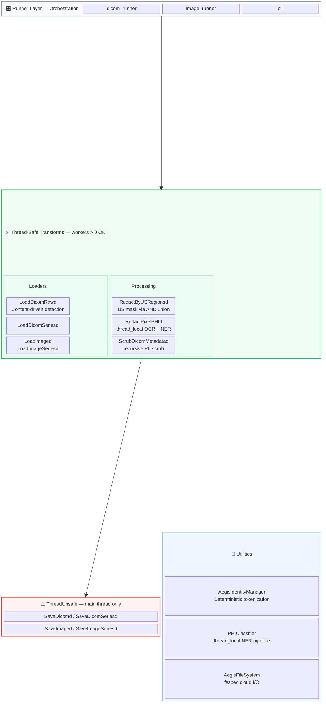

# Aegis

**Medical Image De-identification Pipeline with OCR, NER, and Series-Aware Volume Processing**

Aegis is a production-ready pipeline for de-identifying medical images (DICOM series, individual DICOMs, JPEG, PNG) by removing Protected Health Information (PHI) while preserving critical clinical markers, image quality, and geometric metadata. DICOM discovery is content-driven (preamble sniffing), so extensionless hospital exports are detected automatically.

### Use Cases

- Preparing anonymized medical imaging datasets for AI training
- Batch de-identification of DICOM studies
- Reproducible preprocessing pipelines for research datasets
- Extensible transforms for modality-specific workflows (e.g., ultrasound)
- Cloud-native processing with S3, GCS, or Azure storage backends

---

## 🌟 Features

### Visual De-identification (Pixel Redaction)
- **Stanford NER-based PHI detection** — semantic classification via `stanford-deidentifier-base` (F1 ≥ 97.9%)
- **3-layer classification pipeline**: clinical allowlist → PHI heuristics → NER model
- **EasyOCR-based text detection** with configurable confidence thresholds
- **US fan-geometry scoped OCR** — reads `SequenceOfUltrasoundRegions` (0018,6011) from DICOM metadata to restrict OCR to non-diagnostic zones, eliminating false positives in the clinical fan area
- **Regex safelist fallback** — preserved for environments without NER model
- **Low-confidence routing** — images with uncertain OCR are flagged for manual review
- **Redaction mask output** — redacted regions are exposed as side-channel metadata for downstream review
- **Fully configurable** — PHI labels, clinical allowlist, clinical patterns, and PHI heuristics all defined in `config.yaml`

### Content-Driven Discovery
- **DICOM preamble sniffing** — detects DICOM files by reading the 132-byte header (`DICM` magic), not by file extension
- **Extensionless support** — hospital exports without `.dcm` extension are discovered automatically
- **Three-tier detection** — skip known image extensions → fast-track `.dcm` → preamble-sniff extensionless/unknown files
- **Exported utility** — `is_dicom_file(path)` available for external consumers

### Adaptive Volume Redaction
- **Pixel-level union masking** — PHI detected on *any* sampled keyframe is redacted on *all* frames in the volume
- **Adaptive keyframe sampling** — 10% of frames (floor=3, ceiling=25), always includes first and last
- **Conservative by design** — eliminates silent misses where PHI shifts position across slices

### Separate Pipeline Architecture
- **DICOM pipeline** (`monai_aegis.dicom_runner`) — DICOM single-file or series-aware volume mode
- **Image pipeline** (`monai_aegis.image_runner`) — JPEG/PNG single-file or series-aware folder processing
- **Unified orchestrator** (`monai_aegis.cli`) — `--mode auto|dicom|image`
- **Thin orchestration layer** — runners resolve config/paths, execute DataLoaders, quarantine failures, and summarize results
- **Independent scaling** — each pipeline can run on separate infrastructure

### Cloud Storage (fsspec)
- **Pluggable backends** — local filesystem, S3, GCS, Azure via `fsspec`
- **Byte-stream I/O** — no temp files for cloud reads/writes
- **Environment-aware config** — `${VAR_NAME:default}` interpolation with overlay support

### Metadata De-identification (DICOM)
- **Configurable PII mapping** with REMOVE / DUMMY / ZERO actions
- **Deterministic tokenization** for patient identifiers (enables re-identification if needed)
- **Private tag removal** for enhanced privacy

### Pipeline Architecture
- **MONAI-compliant transforms** — array + dictionary variants, `MetaTensor` propagation
- **Four pipeline modes**: DICOM single (`build_pipeline`), DICOM series (`build_series_pipeline`), Image single (`build_image_pipeline`), and Image series (`build_image_series_pipeline`)
- **Shared pixel redaction** — `RedactPixelPHId` is format-agnostic, used across all pipelines
- **Destructive redaction** — `RedactPixelPHId` permanently zeros PHI pixels and exposes redaction masks/stats as side outputs
- **Normalized tokenization contract** — loaders tokenize only the first folder level below `paths.input_dir`; files directly under the input root keep their original layout
- **Safety lock** — warns when prior spatial transforms may compromise OCR accuracy
- **Thread-safe by design** — only save transforms are `ThreadUnsafe`
- **Non-destructive** — input files remain unchanged

---

## ⚖️ Standards Compliance

Aegis implements the **DICOM PS3.15 Basic Application Level Confidentiality
Profile** (Annex E) for DICOM metadata de-identification, with the following
options enabled:

- **Basic Application Level Confidentiality Profile** (mandatory baseline)
- **Clean Pixel Data Option** — OCR + NER-based burnt-in PHI removal
- **Retain Longitudinal Temporal Information with Modified Dates Option**
  (dates zeroed, not removed, to preserve relative temporal relationships)

All DICOM UIDs (StudyInstanceUID, SeriesInstanceUID, SOPInstanceUID) are
replaced with deterministically generated tokens via `AegisIdentityManager`,
satisfying the PS3.15 UID replacement requirement (action U) while
enabling re-linkage when the original salt is available.

HIPAA Safe Harbor de-identification is satisfied as a consequence of
PS3.15 Basic Profile compliance, since the 18 HIPAA identifiers are a
subset of the tags addressed by the Basic Profile.

---

## 🔧 Architecture

### Architecture Diagram

```mermaid
flowchart LR
    classDef input fill:#dbeafe,stroke:#1e40af,stroke-width:2px,color:#1e3a5f,font-weight:bold;
    classDef load fill:#d1fae5,stroke:#047857,stroke-width:2px,color:#064e3b;
    classDef logic fill:#ede9fe,stroke:#6d28d9,stroke-width:2px,color:#4c1d95;
    classDef ai fill:#fef3c7,stroke:#d97706,stroke-width:2px,color:#78350f;
    classDef save fill:#fce7f3,stroke:#be185d,stroke-width:2px,color:#831843;
    classDef output fill:#f1f5f9,stroke:#475569,stroke-width:2px,color:#1e293b;
    classDef reject fill:#fee2e2,stroke:#dc2626,stroke-width:2px,color:#7f1d1d;

    IN_DCM["📁 DICOM\n.dcm / extensionless"]:::input
    IN_IMG["🖼️ Images\n.jpg / .png"]:::input

    subgraph READ ["① FILE READ — One Read per File"]
        direction TB
        DCM_LOAD["LoadDicomRawd\npydicom.dcmread → Dataset\npixel_array → MetaTensor"]:::load
        IMG_LOAD["LoadImaged\nPIL.open → MetaTensor"]:::load
    end

    subgraph LOGIC ["② IN-MEMORY LOGIC — Zero Disk Access"]
        direction TB
        US["RedactByUSRegionsd\nBuild PHI-zone mask\nfrom tag 0018,6011"]:::logic
        subgraph OCR_NER ["RedactPixelPHId"]
            direction TB
            OCR["EasyOCR\ntext detection"]:::ai
            NER["PHIClassifier\n1. Allowlist\n2. Heuristics\n3. Stanford NER"]:::ai
            MASK["Apply redaction\nmask"]:::logic
        end
        SCRUB["ScrubDicomMetadatad\nPII actions + tokenization\non cached Dataset"]:::logic
    end

    subgraph WRITE ["③ FILE WRITE — ThreadUnsafe"]
        SAVE["SaveDicomd\nSaveDicomSeriesd\nSaveImaged"]:::save
    end

    OUT_OK["✅ staging_output/\nDe-identified"]:::output
    OUT_NO["⚠️ staging_not_processed/\nManual review"]:::reject

    IN_DCM --> DCM_LOAD
    IN_IMG --> IMG_LOAD
    DCM_LOAD -- "MetaTensor\n+ cached Dataset" --> US
    IMG_LOAD -- "MetaTensor" --> OCR
    US -- "us_phi_mask" --> OCR
    OCR -- "low confidence" --> OUT_NO
    OCR -- "detections" --> NER
    NER --> MASK
    MASK --> SCRUB
    DCM_LOAD -. "cached Dataset" .-> SCRUB
    SCRUB --> SAVE
    SAVE --> OUT_OK
```



### Component Interaction & Thread Safety



An architectural priority is **strict I/O separation**. All file I/O flows through `AegisFileSystem` (fsspec) for cloud-native reads/writes, while transform logic stays purely in-memory. The pipeline is split into three explicit zones:

### 1. I/O Boundary: File Read (One Read per File)

Each file is read from disk **exactly once** during ingestion. The two format paths differ in what they cache:

* **DICOM Load (`LoadDicomRawd` / `LoadDicomSeriesd`)**: Uses content-driven detection (tries `pydicom.dcmread` first, falls back to image loading) to parse DICOM files of any extension (including extensionless exports) into a `pydicom.Dataset`, then:
   * **Caches** the full `pydicom.Dataset` object in the data dict (`{key}_dicom_dataset`) — this is what `ScrubDicomMetadatad` consumes later without any disk access.
   * **Extracts** `pixel_array` from the Dataset and wraps it into a channel-first MONAI `MetaTensor` (`C, H, W`).
   * Enriches `MetaTensor.meta` with acquisition metadata (modality, patient ID, study date).
* **Image Load (`LoadImaged` / `LoadImageSeriesd`)**: Opens JPEG/PNG via PIL, converts to a channel-first `MetaTensor`. No Dataset caching (no metadata to scrub). Image-series loading validates geometry before stacking.
* Both paths use `AegisFileSystem` byte streams for cloud storage compatibility.

### 2. Logic Zone (Purely In-Memory — Zero Disk Access)
* **US Region Masking (`RedactByUSRegionsd`)**: For US-modality DICOMs with a `SequenceOfUltrasoundRegions` (0018,6011) tag, reads the scanner-reported pixel boundaries of the diagnostic fan region(s) and builds a boolean PHI-zone mask `(H, W)`. Regions are **deduplicated by geometry** — identical `(x0, y0, x1, y1, spatial_format)` entries (common in enhanced multi-frame DICOMs with one region record per frame) are collapsed to a single mask-paint. In **series mode**, `build_us_phi_mask` is called on every dataset in the series and the resulting masks are combined with bitwise AND — a pixel is in the PHI zone only if it lies outside the diagnostic fan on every slice, conservatively preserving the full union of diagnostic area. The final mask is written to `{key}_us_phi_mask` in the data dict for downstream consumption. Non-US modalities pass through unchanged (no-op). Thread-safe, stateless, zero disk I/O.
* **Redact (`RedactPixelPHId`)**: A destructive `MapTransform` that uses EasyOCR to detect text on the `MetaTensor` pixels, then classifies each detection through a **3-layer pipeline**:
   * **(1) Clinical allowlist**: preserves known device/parameter terms.
   * **(2) PHI heuristics**: catch obvious date-IDs and institution names.
   * **(3) Stanford NER**: the `stanford-deidentifier-base` model provides semantic classification for remaining text.
   
   When a `{key}_us_phi_mask` is present (written by `RedactByUSRegionsd`), OCR is scoped to only the non-diagnostic zones (annotation/overlay areas where burnt-in PHI lives). Diagnostic fan pixels are zeroed before OCR and restored afterward, eliminating false positives in the clinical image area. A binary **redaction mask** (matched to the MetaTensor's `spatial_shape`) is generated from PHI detections and stored alongside the output image for downstream review. Images with low OCR confidence bypass this step and are routed to `staging_not_processed/` for manual review. A **safety lock** warns if prior spatial transforms may compromise OCR accuracy. When `ner.enabled: false`, the system falls back to regex safelist matching.
* **Scrub (`ScrubDicomMetadatad`)**: A pure in-memory metadata scrubber for DICOMs. It reads the **cached `pydicom.Dataset`** written by the Ingestion Zone — no second disk read occurs. It injects the redacted pixel data into the Dataset and calls `AegisIdentityManager` to perform deterministic tokenization, dummy replacement, or removal of designated DICOM tags. Skipped entirely for JPEG/PNG files.
* **Runner orchestration (`monai_aegis.dicom_runner` / `monai_aegis.image_runner`)**: Config and path resolution, DataLoader execution, quarantine routing to `paths.not_processed_dir`, output cleanup, and run summaries live outside the transform graph.

### 3. I/O Boundary: File Write (One Write per File)
* **DICOM Save (`SaveDicomd` / `SaveDicomSeriesd`)**: Writes de-identified DICOM datasets. `ThreadUnsafe` — MONAI routes all writes to the main thread.
* **Image Save (`SaveImaged` / `SaveImageSeriesd`)**: Converts channel-first tensors back to HWC, normalizes to uint8, and writes PNG/JPEG. `ThreadUnsafe`.


The transform graph is designed to keep heavy OCR and metadata work in-memory while isolating filesystem writes. The runner controls `DataLoader` concurrency via `runtime.dataloader_num_workers`.

* **Configurable Processing Model**: Steps 1–3 (`Load`, `Redact`, `Scrub`) are thread-safe, but worker count is now an explicit runtime setting. In constrained environments, `runtime.dataloader_num_workers: 0` avoids Torch shared-memory failures; higher values can be enabled where multiprocessing is safe.
* **Thread-Local Isolation**: To prevent locking issues and race conditions with stateful AI models, `RedactPixelPHId` utilizes Python's `threading.local()`. This guarantees every worker thread spins up its own isolated EasyOCR reader and NER classifier instances.
* **I/O Isolation for Safety**: The pipeline intentionally marks **Step 4 (`SaveDicomd`)** as `ThreadUnsafe`. MONAI detects this and routes all dataset saving sequential actions to the main thread. This prevents file locking contentions, HDD thrashing, and ensures files uniquely derived from their source are written securely without race conditions.

| Transform | MONAI Bases | Strategy | Invertible | `num_workers > 0` |
|-----------|-------------|----------|------------|-------------------|
| `LoadDicomRawd` | `MapTransform` | Stateless, enriched `MetaTensor.meta` | — | ✅ Safe |
| `LoadDicomSeriesd` | `MapTransform` | Stateless volume loading | — | ✅ Safe |
| `LoadImaged` | `MapTransform` | Stateless image loading | — | ✅ Safe |
| `LoadImageSeriesd` | `MapTransform` | Stateless image series loading | — | ✅ Safe |
| `RedactByUSRegionsd` | `MapTransform` | Reads (0018,6011) from cached Dataset; deduplicates regions by geometry key; series mode unions masks via AND across all slices; no-op for non-US | — | ✅ Safe |
| `RedactPixelPHId` | `MapTransform` | `threading.local()` for EasyOCR + NER; US mask-scoped OCR; keyframe OCR for volumes; emits redaction mask/stats side outputs | — | ✅ Safe |
| `PHIClassifier` | — | `threading.local()` for NER pipeline | — | ✅ Safe |
| `ScrubDicomMetadatad` | `MapTransform` | Pure in-memory; geometry-preserving series scrub | — | ✅ Safe |
| `SaveDicomd` | `MapTransform`, `ThreadUnsafe` | File I/O | — | ⚠️ Main thread sequential write |
| `SaveDicomSeriesd` | `MapTransform`, `ThreadUnsafe` | Series file I/O, path-preserving | — | ⚠️ Main thread sequential write |
| `SaveImaged` | `MapTransform`, `ThreadUnsafe` | Image file I/O | — | ⚠️ Main thread sequential write |
| `SaveImageSeriesd` | `MapTransform`, `ThreadUnsafe` | Image series file I/O | — | ⚠️ Main thread sequential write |

---

## 📦 Installation

### Prerequisites
- Python 3.10+
- Virtual environment recommended

### Install Package
```bash
git clone <repo-url>
cd aegis

python -m venv venv
source venv/bin/activate  # On Windows: venv\Scripts\activate

pip install -e monai_aegis/
```

---

## 🚀 Quick Start

### Command-Line Runners
```bash
# DICOM pipeline — series mode (default)
python -m monai_aegis.dicom_runner --config monai_aegis/config/config.yaml

# DICOM pipeline — single-file mode
python -m monai_aegis.dicom_runner --config monai_aegis/config/config.yaml --mode single

# Image pipeline — series mode (default)
python -m monai_aegis.image_runner --config monai_aegis/config/config.yaml

# Image pipeline — single-file mode
python -m monai_aegis.image_runner --config monai_aegis/config/config.yaml --mode single

# Unified orchestrator — runs both DICOM and Image pipelines
aegis-pipeline --config monai_aegis/config/config.yaml --mode auto

# Output:
#   Processed files → staging_output/dicom/<timestamp>/ or staging_output/image/<timestamp>/
#   Rejected/flagged files → staging_not_processed/ (manual review, geometry mismatch, or transform errors)
```

---

## ⚙️ Configuration

Edit `monai_aegis/config/config.yaml`. Supports `${VAR_NAME:default}` environment variable interpolation:

```yaml
paths:
  input_dir: '${AEGIS_INPUT_DIR:staging_input}'
  output_dir: '${AEGIS_OUTPUT_DIR:staging_output}'
  not_processed_dir: '${AEGIS_REVIEW_DIR:staging_not_processed}'
  dicom_folder: 'dicom'
  image_folder: 'image'
  timestamp_format: '%Y-%m-%d_%H-%M'

runtime:
  dataloader_num_workers: 0

storage:
  protocol: '${AEGIS_STORAGE_PROTOCOL:file}'   # file, s3, gs, az
  options: {}                                   # fsspec options (credentials, etc.)

tokenization:
  salt: '${AEGIS_TOKEN_SALT:}'

series:
  enabled: true
  accepted_modalities: ['CT', 'MR', 'US', 'CR', 'DX', 'MG', 'PT', 'XA', 'RF', 'OT']
  keyframe_sampling:
    sample_pct: 0.10    # Sample 10% of frames as keyframes
    floor: 3             # Minimum keyframes (below this, scan all)
    ceiling: 25          # Maximum keyframes for very large volumes
  output_structure: 'hierarchical'

us_regions:
  enabled: true                   # Enable US fan-geometry scoped OCR
  zero_outside_regions: true      # Zero diagnostic pixels before OCR

ocr:
  languages: ['en']
  gpu_usage: false
  confidence_threshold: 0.4

ner:
  enabled: true                   # Set false to fall back to regex safelist
  model_name: 'StanfordAIMI/stanford-deidentifier-base'
  device: '${AEGIS_DEVICE:cpu}'   # 'cpu', 'cuda', or 'mps'
  phi_labels:                     # NER entity types treated as PHI
    - PATIENT
    - DOCTOR
    - HOSPITAL
    - DATE
    - IDNUM
    # ... (22 labels total)
  clinical_allowlist:             # Terms never redacted
    - mindray
    - ge
    - adult abd n
    # ... (device manufacturers, imaging modes)
  clinical_patterns:              # Regex for clinical/technical text (preserved)
    - '^(F\s*H?\d|D\s+\d|G\s+\d|FR\s+\d|DR\s+\d)'
    - '^(AP|MI|TIS|SSI)\s+\d'
    # ... (probe IDs, measurements, exam types)
  phi_heuristic_patterns:         # Regex for PHI in short OCR fragments (redacted)
    - '^\d{8}[-/]\d{6}[-/]?\w*$'  # Date-ID combos
    - '(?i)(hospital|clinic|diagnostic|medical)'
    # ... (dates, doctor names, patient IDs)

pii_mapping:
  '(0010, 0010)': 'DUMMY'   # PatientName → TOKEN_xxxxx
  '(0010, 0020)': 'DUMMY'   # PatientID → TOKEN_xxxxx
  '(0010, 0030)': 'REMOVE'  # PatientBirthDate → removed
  '(0008, 0020)': 'ZERO'    # StudyDate → 00000000
  '(0008, 0050)': 'REMOVE'  # AccessionNumber → removed
```

Tokenization now follows one rule across single-file and series loaders: if a file sits directly under `paths.input_dir/<dicom_folder|image_folder>`, output stays at the root; otherwise the first relative folder segment is replaced by a deterministic token.

### Cloud Storage (S3 / GCS / Azure)

```yaml
# config.prod.yaml — overlay for cloud deployment
storage:
  protocol: 's3'
  options:
    key: '${AWS_ACCESS_KEY_ID}'
    secret: '${AWS_SECRET_ACCESS_KEY}'

paths:
  input_dir: 's3://my-bucket/incoming'
  output_dir: 's3://my-bucket/deidentified'
```

```bash
# Apply overlay via environment variable
export AEGIS_CONFIG_OVERRIDE=config.prod.yaml
pip install s3fs  # one-time
python -m monai_aegis.dicom_runner --config monai_aegis/config/config.yaml
```

| Backend | Protocol | Extra Package |
|---------|----------|---------------|
| Local   | `file`   | (built-in)    |
| AWS S3  | `s3`     | `s3fs`        |
| GCS     | `gs`     | `gcsfs`       |
| Azure   | `az`     | `adlfs`       |

### NER Classification Pipeline

When `ner.enabled: true`, each OCR-detected text goes through a 3-layer pipeline:

| Layer | Source | Action | Example |
|-------|--------|--------|---------|
| 1. Clinical allowlist | `ner.clinical_allowlist` | **Preserve** | `mindray`, `adult abd n` |
| 2. Clinical patterns | `ner.clinical_patterns` | **Preserve** | `FH5.0`, `D 13.0`, `SC5-1N` |
| 3. PHI heuristics | `ner.phi_heuristic_patterns` | **Redact** | `20260117-091825-6AAA` |
| 4. Stanford NER | `ner.phi_labels` | **Redact if PHI** | Names, remaining identifiers |

### PII Mapping Actions
| Action | Behavior | Example |
|--------|----------|---------|
| `DUMMY` | Replace with deterministic hash token | `John Doe` → `TOKEN_a1b2c3d4e5f6` |
| `REMOVE` | Delete the DICOM tag entirely | Tag removed from dataset |
| `ZERO` | Set to zero / empty value | `20250216` → `00000000` |

---

## 🧪 Testing

```bash
# Run unit tests
python -m unittest discover tests/unit -v

# Run integration tests
python -m unittest discover tests/integration -v
```


---

## 📁 Project Structure

```
aegis/
├── monai_aegis/                      # Installable package
│   ├── pyproject.toml                # PEP 621 package config
│   ├── cli.py                        # aegis-pipeline entry point
│   ├── dicom_runner.py               # Packaged DICOM orchestration
│   ├── image_runner.py               # Packaged image orchestration
│   ├── config/
│   │   ├── config.yaml               # De-identification + NER + storage + series settings
│   │   ├── config_loader.py          # Env var interpolation + overlay merging
│   │   └── storage.py                # AegisFileSystem (fsspec wrapper)
│   └── transforms/
│       ├── __init__.py                # Public API exports
│       ├── io.py                      # LoadDicomRaw/d, SaveDicom/d, LoadImage/d, SaveImage/d
│       ├── series_io.py               # LoadDicomSeries/d, SaveDicomSeries/d
│       ├── discovery.py               # discover_dicoms, is_dicom_file, group/validate/sort
│       ├── pixel.py                   # RedactPixelPHI/d (OCR + NER + volume keyframe + US mask scoping)
│       ├── us_regions.py              # RedactByUSRegions/d (SequenceOfUltrasoundRegions fan-geometry masking)
│       ├── ner_classifier.py          # PHIClassifier (Stanford NER wrapper)
│       ├── metadata.py                # ScrubDicomMetadata/d (single + series scrub)
│       ├── exceptions.py              # Custom exception hierarchy
│       ├── utility.py                 # AegisIdentityManager + tokenized output path helpers
│       └── pipeline.py                # build_pipeline / build_series_pipeline / build_image_pipeline / build_image_series_pipeline
├── tests/
│   ├── unit/                          # Unit tests
│   │   ├── test_config_loader.py      # Config loading, env vars, overlays
│   │   ├── test_storage.py            # AegisFileSystem, fsspec, byte-stream round-trip
│   │   ├── test_raw_loader.py         # DICOM + image loading transforms
│   │   ├── test_discovery.py          # Discovery, grouping, validation, sorting
│   │   ├── test_series_io.py          # Series load/save transforms
│   │   ├── test_image_series_io.py    # Image series load/save + tokenization
│   │   ├── test_volume_redaction.py   # Volume keyframe OCR
│   │   ├── test_us_regions.py         # US region mask building + pipeline integration
│   │   └── ...                        # Additional test files
│   └── integration/                   # End-to-end tests
├── run_dicom_pipeline.py              # Compatibility wrapper for monai_aegis.dicom_runner
├── run_image_pipeline.py              # Compatibility wrapper for monai_aegis.image_runner
├── run_pipeline.py                    # Compatibility wrapper for monai_aegis.cli
├── de-identification.ipynb            # Interactive walkthrough notebook
├── Dockerfile                         # Container build
├── staging_input/                     # Input files (not tracked)
├── staging_output/                    # Processed output (not tracked)
└── staging_not_processed/             # Low-confidence files for review (not tracked)
```

---


## ⚠️ Error Handling

All transforms use a custom exception hierarchy (defined in `exceptions.py`) that carries **filepath** and **transform name** for diagnostic context:

```
AegisTransformError          ← base (catch-all)
├── DicomLoadError           ← corrupted / unreadable DICOM
├── ImageLoadError           ← unreadable JPEG / PNG
├── PixelRedactionError      ← OCR / NER failure
├── MetadataScrubError       ← tag parsing / pixel injection
├── DicomSaveError           ← write failure
├── SeriesLoadError          ← series assembly / geometry mismatch (NEW)
└── SeriesSaveError          ← series write failure (NEW)
```

**Usage in calling code:**

```python
from monai_aegis.transforms.exceptions import AegisTransformError, DicomLoadError

try:
    result = pipeline({'image': filepath})
except DicomLoadError as e:
    print(f"Bad DICOM: {e.filepath} in {e.transform}")
except AegisTransformError as e:
    print(f"Pipeline error: {e}")  # catches any transform failure
```

---

## 🐳 Docker

```bash
# Build
docker build -t aegis:latest .

# Run DICOM pipeline
docker run --rm \
  -v "$(pwd)/staging_input:/app/staging_input:ro" \
  -v "$(pwd)/staging_output:/app/staging_output" \
  aegis:latest aegis-pipeline --mode dicom

# Run Image pipeline
docker run --rm \
  -v "$(pwd)/staging_input:/app/staging_input:ro" \
  -v "$(pwd)/staging_output:/app/staging_output" \
  aegis:latest aegis-pipeline --mode image

# Run tests
docker run --rm aegis:latest \
  python -m unittest discover /app/tests/unit -v
```

See [DOCKER_TESTING.md](DOCKER_TESTING.md) for full Docker guide.

---

## 🤝 Contributing

```bash
# Install dev dependencies
pip install -e "monai_aegis/[dev]"

# Format
black monai_aegis/transforms/ tests/

# Lint
flake8 monai_aegis/transforms/ tests/

# Type check
mypy monai_aegis/transforms/
```

---

## 📄 License

Apache 2.0 (pending)

---

## 🙏 Acknowledgments

- [MONAI](https://docs.monai.io/) — Medical Open Network for AI
- [StanfordAIMI](https://huggingface.co/StanfordAIMI/stanford-deidentifier-base) — Stanford De-identifier NER model
- [EasyOCR](https://github.com/JaidedAI/EasyOCR) — OCR detection library
- [HuggingFace Transformers](https://huggingface.co/docs/transformers/) — NER pipeline
- [PyDICOM](https://pydicom.github.io/) — DICOM file handling
- [HIPAA De-identification Guidelines](https://www.hhs.gov/hipaa/for-professionals/privacy/special-topics/de-identification/index.html)
