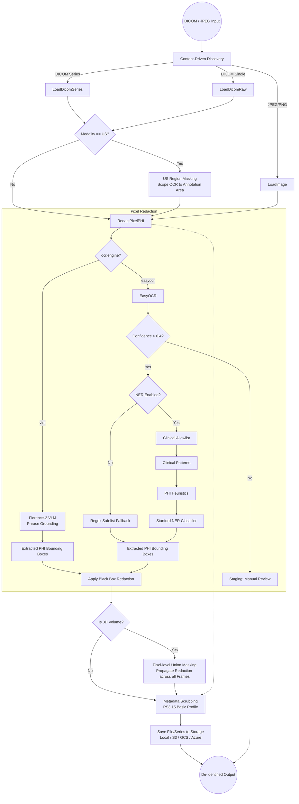

# Aegis VLM Pipeline Architecture

This diagram illustrates the dual-engine architecture of Aegis, showing the data flow for both the Standard EasyOCR+NER path and the new End-to-End VLM path.

```mermaid
graph TD
    %% Input Layer
    Input((DICOM / JPEG Input)) --> Discovery[Content-Driven Discovery]
    
    %% Ingestion Layer
    Discovery --> |DICOM Series| LoadSeries[LoadDicomSeries]
    Discovery --> |DICOM Single| LoadSingle[LoadDicomRaw]
    Discovery --> |JPEG/PNG| LoadImage[LoadImage]
    
    %% US Region Scoping
    LoadSeries --> IsUS{Modality == US?}
    LoadSingle --> IsUS
    IsUS -->|Yes| USRegion[US Region Masking<br>Scope OCR to Annotation Area]
    IsUS -->|No| RedactPixel
    USRegion --> RedactPixel
    LoadImage --> RedactPixel
    
    %% Redaction Engine Branch
    subgraph Redaction Engine [Pixel Redaction]
        RedactPixel[RedactPixelPHI] --> EngineCheck{ocr.engine?}
        
        %% VLM Branch
        EngineCheck -->|vlm| VLM[Florence-2 VLM<br>Phrase Grounding]
        VLM --> BBoxesVLM[Extracted PHI Bounding Boxes]
        
        %% OCR Branch
        EngineCheck -->|easyocr| OCR[EasyOCR]
        OCR --> ConfCheck{Confidence > 0.4?}
        ConfCheck -->|No| RejectQueue[Staging: Manual Review]
        ConfCheck -->|Yes| SafelistCheck{NER Enabled?}
        
        SafelistCheck -->|No| Safelist[Regex Safelist Fallback]
        Safelist --> BBoxesOCR
        
        SafelistCheck -->|Yes| ClinAllow[Clinical Allowlist]
        ClinAllow --> ClinPattern[Clinical Patterns]
        ClinPattern --> PHIHeuristics[PHI Heuristics]
        PHIHeuristics --> NER[Stanford NER Classifier]
        NER --> BBoxesOCR[Extracted PHI Bounding Boxes]
        
        %% Masking
        BBoxesVLM --> Masking[Apply Black Box Redaction]
        BBoxesOCR --> Masking
    end
    
    %% Volume Union Mask
    Masking --> VolCheck{Is 3D Volume?}
    VolCheck -->|Yes| UnionMask[Pixel-level Union Masking<br>Propagate Redaction across all Frames]
    VolCheck -->|No| ScrubMeta
    UnionMask --> ScrubMeta
    
    %% Metadata Scrubbing (DICOM only)
    RedactPixel -.-> ScrubMeta
    ScrubMeta[Metadata Scrubbing<br>PS3.15 Basic Profile]
    
    %% Storage Output
    ScrubMeta --> Save[Save File/Series to Storage<br>Local / S3 / GCS / Azure]
    Save --> Output((De-identified Output))
    RejectQueue -.-> Output
```
